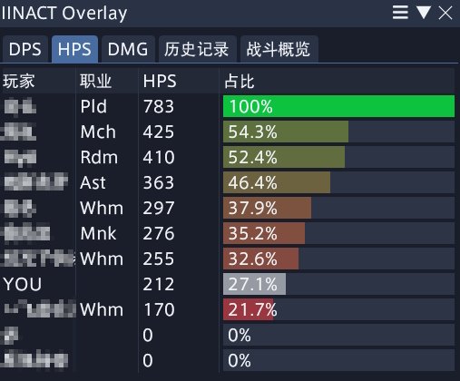
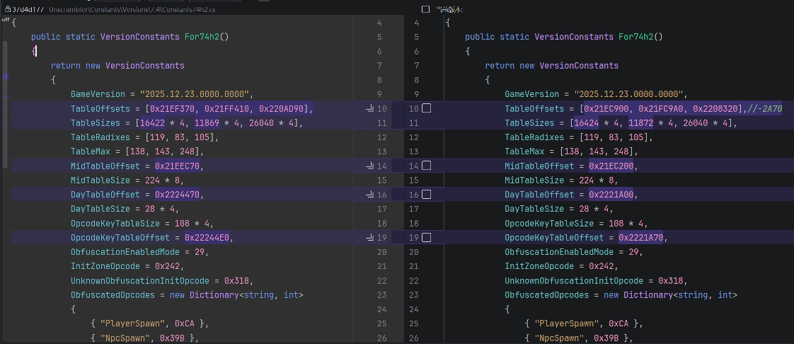

> 友情裤链: https://raw.githubusercontent.com/Latihas/dalamud-plugins/main/repo.json


## IINACT改版，整合了CN、Triggernometry、PostNamazu

# 重要提醒！！！请一定要先看完介绍再使用，本插件仍然不是很稳定，有炸游戏风险

# 项目介绍

修改IINACT的初衷旨在尽可能满足日常对ACT的基本需求，替代ACT，假装自己是西瓜玩。

本项目仍然处于野蛮开发期，代码管理极其混乱，暗藏神秘bug，仅作开发测试使用。

该插件会在一个类ACT的环境下运行FFXIV_ACT_Plugin与大量修改的Overlay
Plugin以适配现代.NET。与此同时，也添加了大量修改的Triggernometry与Postnamazu。包括类ACT、Triggernometry、Postnamazu在内，这些并非完整的代码移植，并且仍在开发完善中，可能缺少部分原版的函数，开发时请注意。

相关参考文献如下：
> IINACT官方: https://github.com/marzent/IINACT
>
> IINACT CN: https://github.com/MeowZWR/IINACT
>
> Machina: https://github.com/MeowZWR/machina
>
> Edge TTS: https://github.com/AtmoOmen/EdgeTTS
>
> Triggernometry: https://github.com/MnFeN/Triggernometry
>
> PostNamazu: https://github.com/Natsukage/PostNamazu

# 悬浮窗

开发者偏好使用Browsingway，但是IINACT原版的URL生成器指向的在线页面可能不是最新版，建议指向本地ACT的目录

比如开发者的ACT装在D盘，那么URL就类似于 file:///D:
/ACT.DieMoe/Plugins/ACT.OverlayPlugin/cactbot/ui/raidboss/raidboss.html?timeline=1&alerts=1

有时候bw会不显示东西（如时间轴），需要手动在bw里面刷新一下。每次插件加载会自动刷新bw的(时间轴,设置)悬浮窗。

IINACTEx也有内置一个原生的伤害统计悬浮窗，输入/iinactoverlay可打开。提供最基础的统计功能:



# TTS/Cactbot

IINACT CN默认使用了EdgeTTS，如果你EdgeTTS工作正常可以跳过这部分。由于开发者比较喜欢用LatihasTTS(纯本地模型推理)
所以也做了接口。由于文件过大放不上Github所以需要联系开发者获取。(其实也没那么必须，只是开发者用着舒服)

cactbot资源可在 https://raw.githubusercontent.com/Latihas/dalamud-plugins/main/cactbot.zip 下载。

仅需将相关文件放入插件安装目录下即可使用，加号代表添加的文件，像这样:

Cactbot:

- $(pluginConfigs/IINACTEx)
    - Scripts/
    - TriggernometryRepoBackups/
    - PostNamazu.config.xml
    - Triggernometry.config.xml
    - +cactbot.zip
    - ...

LatihasTTS:

- $(installedPlugins/IINACTEx)
    - Advanced Combat Tracker.dll
    - Triggernometry.dll
    - +TtsAssets/
        - +pinyin.txt
        - +symbol.txt
        - +vocab.txt
        - +a.ort
        - +v.ort
        - +...
    - ...

目前支持cactbot.zip一键下载安装，比较依赖网络环境。手动的话资源放在插件Config目录，cactbot可以选择手动解压，也可以在插件下次加载时自动解压。

# 已知限制

不要在插件加载后立刻卸载插件，否则大概率会线程回收失败，只能重启游戏解决。

Triggernometry有时会因为宝宝椅的鲇鱼精扩展功能炸游戏/显示异常/...。开发者用Penumbra可以恢复部分图形问题。

IActPluginV1仅为不报错存在，不会执行加载等逻辑。

Postnamezu的Preset不可用。

触发器有时候声音比较小，减小游戏音量以调整。

Triggernometry的配置文件与ACT版本完全兼容，可以直接把act的配置文件复制到插件配置目录下。

Triggernometry的触发器不支持导入文件，过大的触发器建议分批导入。

Triggernometry保存配置逻辑与原版一致，即每5分钟或是卸载时，所以游戏崩溃可能会丢失配置。请导入或修改过任何触发器/配置/...后点击`保存
配置`按钮手动保存。

Triggernometry的部分高级内存操作与回调不可用。

Triggernometry的重复触发器导入重命名可能有问题，请尽量不要二次导入相同的触发器。

Triggernometry的部分编辑器还没写。

Triggernometry的绝大部分Form或Control因兼容性被移除，可能误伤配置弹出框，一般报错中可以看出来。

# 常见问题

问题太多了。如果出现bug，试着关开一下插件，说不定就自己会好了。

可以提issue让我写进来。

# 开发相关

本分支基于国服IINACT开发，如需移植到国际服理论上仅需修改IINACT官库与CN库的区别即可(
可能有部分翻译由于开发时未注意多语言需要适配一下)。

同理，卫月路径也需要改一下，在仓库目录中Directory.Build.props。

仓库目录中TrnDevEnv项目为Triggernometry脚本编写环境，喜欢用IDE的小朋友可以用这个开发。

# Unscrambler

以7.40patch2为例。

## 缓兵之计(等上游更新)

虽然CN服与国际服已经同步，但是客户端依旧有部分差异。IINACT使用Unscrambler进行网络包的反混淆，并且使用固定偏移生成Table，所以国际服与国服会存在数据上的差别(
如ACT的伤害日志错误)。如果需要快速修复，可以用我编译好的包里的Unscrambler.dll替换掉即可。完整的从头修复的方案如下(
其实也不是从头，我ida也没怎么搞明白)：

1. 等待上游 https://github.com/perchbirdd/Unscrambler 更新到当前版本。(因为我不知道怎么自己找)。然后git clone到本地。
2. 找到最新的Constants文件(Unscrambler/Constants/Versions/7.4/Constants74h2.cs，记得换为当前版本)
   。这里我们着重关注TableOffset，并稍微关注一下TableSize。以变量TableOffsets的第一个值(0x21EF370)
   为例，首先需要获取一下FFXIV的国际服客户端。然后打开ida，载入国际服客户端，在IDA View-A中右键左侧的地址(类似.rdata:
   000000014XXXXXXX，我不清楚这个14会不会变，后续会用到),右键Jump to address，输入1421EF370，OK之后会发现指向了一个类似(
   .rdata:000000014YYYYYYY dword_ZZZZZZZZZ)的地方，选中这个值，点开Hex View-1，右键Synchronize with -> IDA
   View-A，会高亮出前几个字节，将这几个字节及后面一些字节(10个左右，不用太多，能保证唯一性就行)作为特征Sig复制出来。
3. 打开一个新的ida，载入CN客户端，菜单栏Search -> Sequence of bytes，输入刚才复制的Sig，OK后会跳到一个类似(.rdata:
   000000014AAAAAAA dword_BBBBBBBBB)的地方，这里的AAAAAAA就是我们要找的值(21EC900)
   。将上文的0x21EF370替换为0x21EC900即可，其余TableOffset如法炮制(
   TableOffsets，MidTableOffset，DayTableOffset，OpcodeKeyTableOffset)
4. [小贴士] 由于客户端结构相似，在示例版本中，所有TableOffset都满足: 国际服-CN=(0x21EF370-0x21EC900)
   =0x2A70，所以理论上你找到第一个偏差之后，其余的只要在国际服基础上-0x2A70就可以了
5. [可选] 其实到这里就基本可以结束了，如果想要更精确一些，可以修改TableSize。只需要右键点击dword_BBBBBBBBB，点击Array，就可以看到Array
   Size了。不过一般不需要改，因为客户端结构相似。
6. 然后就是编译了。
   在这之前，请确保ConstantsXX.cs已被正确修改。首先构建Unscrambler.DataGenerator，然后运行的时候需要两个参数(
   游戏路径，生成路径)，cd到编译后的目录，执行(Unscrambler.DataGenerator.exe "C:\Program Files (x86)
   \上海数龙科技有限公司\最终幻想XIV\game\ffxiv_dx11.exe" .)就行了。然后会在生成路径(.)
   中找到当前游戏版本号的文件夹，将文件夹复制到Unscrambler\Data文件夹，如果你使用的是支持Git的IDE，可以看到tableX.bin有修改。然后再构建Unscrambler，将生成的dll直接替换掉IINACT编译目录下的Unscrambler就可以完成修复。



## 自食其力(自己改)

原文(https://github.com/perchbirdd/Unscrambler)的Readme介绍了相关数据结构。

由于我的IDA不知道什么毛病，原文中的`Derive`函数无法正确反编译(F5返回空函数体)
；FFXIVClientStructs也不知道什么毛病，无法正确映射相关函数名称。但是没关系，还是可以看的，就是稍微看起来不够直观一些。本流程使用IDA
Pro
7.7/9.2，无需Python环境，导入exe时无需开启Analysis，无需Pdb。

小提示：14为一些地址开头，我们要找的是14后面的地址。

1. 找到`Client::Network::PacketDispatcher_OnReceivePacket`函数(也可能找到的是内层函数)。
   由于FFXIVClientStructs无法正确标记函数名称，我们使用签名进行函数定位。
   在`IINACT\Network\ZoneDownHookManager.cs`中，可以找到该函数的sig(可能随版本变化，不一定每个版本都会变):

```c#
private const string OpcodeKeyTableSignature = "?? ?? ?? 2B C8 ?? 8B ?? 8A ?? ?? ?? ?? 41 81";
```

IDA->Search->Sequence of bytes->输入?? ?? ?? 2B C8 ?? 8B ?? 8A ?? ?? ?? ?? 41 81->OK->回车->F5->F5。

2. 寻找Derive函数表格区域，ObfuscationEnabledMode，UnknownObfuscationInitOpcode。

在上述函数的靠前位置寻找类似区域：

```c++
//上面是一大堆寄存器和变量定义
char v183; // [rsp+3C78h] [rbp+3B78h]

  v3 = *(unsigned __int16 *)(a3 + 2);
  if ( v3 == 792 ) // UnknownObfuscationInitOpcode
  {
    v7 = *(_BYTE *)(a3 + 22);
    v149 = (int)sub_141D29D70() % 255 + 1;
    a1[7] = v149;
    if ( v7 == 29 ) // ObfuscationEnabledMode
    {
      v8 = a1[6];
      sub_14181B130(); // Derive
      a1[8] = v8 + v149 + v9;
      sub_14181B130(); // Derive
      a1[9] = v149 + v8 + v10;
      sub_14181B130(); // Derive
      a1[10] = v149 + v8 + v11;
    }
    else
    {
      a1[8] = (unsigned int)sub_141D29D70() % (a1[6] + a1[7]);
      a1[9] = (unsigned int)sub_141D29D70() % (a1[6] + a1[7]);
      a1[10] = (unsigned int)sub_141D29D70() % (a1[6] + a1[7]);
    }
  }
  v12 = a1[7];
  v13 = a1[6];
  v14 = 0;
  v12 = a1[7];
  v13 = a1[6];
  v14 = 0;
  if ( a1[8] < (unsigned int)(v13 + v12) )
    goto LABEL_100;
  v15 = a1[v3 % 3 + 8] - v13 - v12;
  v16 = dword_142221A70[(v15 + v3) % 0x6C]; //OpcodeKeyTableOffset
  if ( v3 > 0x185 )
  {
    if ( v3 <= 0x253 )
    {
      if ( v3 != 595 )
      {
        switch ( v3 )
//下面是一大堆switch-case，用于OpCode分包
```

ObfuscationEnabledMode就在注释中，为29。UnknownObfuscationInitOpcode就在注释中，为792

由于IDA抽风的原因，每次打开对于`Derive`函数的描述可能有差异，具体表现为：这个语句可以类似

```c++
a1[8] = v137 + v10 + sub_14181B130(0, v7, v9, v136);
```

也可以类似

```c++
sub_14181B130();
a1[8] = v8 + v149 + v9;
```

不管怎么样，sub_14181B130就是我们要找的`Derive`函数，181B130这个地址会随版本变化而变化。
IDA->View->Open subviews->Disassembly->右键左侧地址区域->Jump to address->输入`Derive`函数地址(14181B130)，就可以看到
`Derive`函数，类似于

```asm
.text:000000014181B130 ; void sub_14181B130()
.text:000000014181B130 sub_14181B130   proc near               ; CODE XREF: sub_1418157A0+F0↑p
.text:000000014181B130                                         ; sub_1418157A0+10D↑p ...
.text:000000014181B130
.text:000000014181B130 arg_0           = qword ptr  8
.text:000000014181B130 arg_8           = qword ptr  10h
.text:000000014181B130
.text:000000014181B130                 mov     [rsp+arg_8], rsi
.text:000000014181B135                 push    rdi
.text:000000014181B136                 movzx   esi, r8b
.text:000000014181B13A                 movzx   r8d, dl
.text:000000014181B13E                 movzx   r10d, cl
.text:000000014181B142                 test    cl, cl
.text:000000014181B144                 jz      loc_14181B2E9 ; 函数1
.text:000000014181B14A                 sub     r10d, 1
.text:000000014181B14E                 jz      loc_14181B24D ; 函数2
.text:000000014181B154                 cmp     r10d, 1
.text:000000014181B158                 jz      short loc_14181B163 ; 函数3
.text:000000014181B15A                 xor     eax, eax
.text:000000014181B15C                 mov     rsi, [rsp+8+arg_8]
.text:000000014181B161                 pop     rdi
.text:000000014181B162                 retn
```

我们要关注的就是函数123。

3. TableOffsets，TableRadixes，TableMax

这一步要找的语句类似于ds:rva dword_14XXXXXXX[YYYY]，以及往上的几行。

+ 双击函数1(loc_14181B2E9)，找到语句

```asm
.text:000000014181B367                 imul    eax, edx, 8Ah
.text:000000014181B36D                 sub     ecx, eax
.text:000000014181B36F                 mov     eax, ecx
.text:000000014181B371                 imul    rcx, rax, 77h ; 'w'
.text:000000014181B375                 add     r8, rcx
.text:000000014181B378                 mov     ecx, ds:rva dword_1421EC900[rdi+r8*4]
```

其中21EC900就是TableOffsets[0]，0x77=119就是TableRadixes[0]，0x8A=138就是TableMax[0]

+ 双击函数2(loc_14181B24D)，找到语句

```asm
.text:000000014181B2CB                 imul    eax, edx, 8Fh
.text:000000014181B2D1                 sub     ecx, eax
.text:000000014181B2D3                 mov     eax, ecx
.text:000000014181B2D5                 imul    rcx, rax, 53h ; 'S'
.text:000000014181B2D9                 add     r8, rcx
.text:000000014181B2DC                 mov     ecx, ds:rva dword_1421FC9A0[rdi+r8*4]
```

其中21FC9A0就是TableOffsets[1]，0x53=83就是TableRadixes[1]，0x8F=143就是TableMax[1]

+ 双击函数3(loc_14181B163)，这个结构比较复杂，我写了注释：

```asm
.text:000000014181B1C4                 imul    ecx, [r10+rdi+21EC200h]
; 一些东西
.text:000000014181B1FC                 imul    ecx, 0F8h
.text:000000014181B202                 sub     r8d, ecx
.text:000000014181B205                 mov     ecx, r8d
.text:000000014181B208                 imul    rdx, rcx, 69h ; 'i'
.text:000000014181B20C                 add     r9, rdx
.text:000000014181B20F                 mul     r11d
.text:000000014181B212                 mov     ecx, ds:rva dword_142208320[rdi+r9*4]
; 一些东西
.text:000000014181B22C                 add     ecx, ds:rva dword_142221A00[rdi+r11*4]
.text:000000014181B234                 add     ecx, [r10+rdi+21EC204h]
```

其中2208320就是TableOffsets[2]，0x69=105就是TableRadixes[2]，0xF8=248就是TableMax[2]

21EC200就是MidTableOffset，2221A00就是DayTableOffset，2221A70就是OpcodeKeyTableOffset。

OpcodeKeyTableOffset也可以通过上述第二步通过OpcodeKeyTableSignature定位时找到的类似于

```asm
 v16 = dword_142221A70[(v15 + v3) % 0x6C];
```

的语句来定位

21EC204没用到，原文中反编译代码类似

```asm
midTable[4 + midIndex]
```

应该是MidTableOffset下标固定偏移量

4. 其余小项目

GameVersion可以在C:\Program Files (x86)\上海数龙科技有限公司\最终幻想XIV\game\ffxivgame.ver中找到。

TableSizes可以通过：双击dword_XXXXXXXXX->右键dword_XXXXXXXXX->Array，就可以看到Array Size了。代码中后面乘的系数(4,8)
一般不会变，是根据变量的类型决定大小的。

InitZoneOpcode似乎在7.4后废弃了(?)，暂时还不知道怎么改。ObfuscatedOpcodes也不知道怎么定位。

> 以下是IINACT CN原版的介绍

## 笔记

> 国服兼容 [授人以渔](https://www.bilibili.com/opus/1045734514081398787)  
> 自然语音 [EdgeTTS](https://github.com/AtmoOmen/EdgeTTS)  
> ACT解析 [FFXIV_ACT_Plugin_CN](https://github.com/NewMoe-Technology/FFXIV_ACT_Plugin_CN)  
> [opcodes.jsonc](https://github.com/OverlayPlugin/OverlayPlugin/blob/main/OverlayPlugin.Core/resources/opcodes.jsonc)  [FFXIVProcessCn.cs](https://github.com/OverlayPlugin/cactbot/blob/main/plugin/CactbotEventSource/FFXIVProcessCn.cs)  [opcodes.jsonc](https://github.com/moewcorp/FFXIVNetworkOpcodes/tree/master/output)


# IINACT

A [Dalamud](https://github.com/goatcorp/Dalamud) plugin to run
the [FFXIV_ACT_Plugin](https://github.com/ravahn/FFXIV_ACT_Plugin) in an [ACT](https://advancedcombattracker.com/)-like
enviroment with a heavily modified port of [Overlay Plugin](https://github.com/OverlayPlugin/OverlayPlugin) for modern
.NET.

The data source here is only based on [Unscrambler](https://github.com/perchbirdd/Unscrambler) and does not require any
extra injection with [Deucalion](https://github.com/ff14wed/deucalion) or network capture with elevated privileges.

This will **not** render overlays by itself, use something
like [Browsingway](https://github.com/Styr1x/Browsingway), [Next UI](https://github.com/kaminaris/Next-UI), [hudkit](https://github.com/valarnin/hudkit) (
Linux only) or [Bunny HUD](https://github.com/marzent/Bunny-HUD) (macOS only) to display Overlays.

## Why

- ACT is too inconvenient IMHO for just wanting to have the game data parsed and served via a WebSocket server
- Drastically more efficent than ACT, in part to .NET 7.0, in part to a more sane log line processing (disk I/O is not
  blocking LogLineEvents and happening on a separate lower priority thread)
- Due to the above and running fully inside the game process CPU usage will be orders of magnitude (not exaggerating
  here) lower when running under Wine compared to network-based capture
- Uses an ultra fast and low latency WebSocket server based
  on [NetCoreServer](https://github.com/chronoxor/NetCoreServer)
- Doesn't use legacy technology that hurts Linux and macOS users
- Follows the Unix philosophy of just doing one thing and doing it well

## Installing

> **Warning**  
> No support will be provided on any Dalamud official support channel. Please use
> the [Issues](https://github.com/marzent/IINACT/issues) page or [Discord](https://discord.gg/pcexJC8YPG) for any
> support
> requests. Do NOT ask for support on the [XIVLauncher & Dalamud Discord](https://discord.gg/holdshift), as support for
> 3rd-party plugins is not provided there.

Install instructions can be found [here](https://www.iinact.com/installation/), but are indentical to any other
3rd-party plugin repository.

## How to build

Just run

```
git clone --recurse-submodules https://github.com/marzent/IINACT.git
cd IINACT
dotnet build
``` 

on a Linux, macOS or Windows machine with the [.NET 7 SDK](https://dotnet.microsoft.com/en-us/download/dotnet/7.0).

You will need to be able to reference Dalamud as well, meaning having an install
of [XL](https://github.com/goatcorp/FFXIVQuickLauncher) or [XOM](https://github.com/marzent/XIV-on-Mac) on Windows and
macOS respectively. On Linux `DALAMUD_HOME` needs to be correctly set (for example `$HOME/.xlcore/dalamud/Hooks/dev`).

## FAQ

**Where are my logs?**

- In your Documents folder. For Windows users, `C:\Users\[user]\Documents\IINACT`. For Mac/Linux users, same thing, but
  relative to your wine prefix.

**Are these logs compatible with FFLogs? Can I use the FFLogs Uploader?**

- Yes! 100% compatible.
